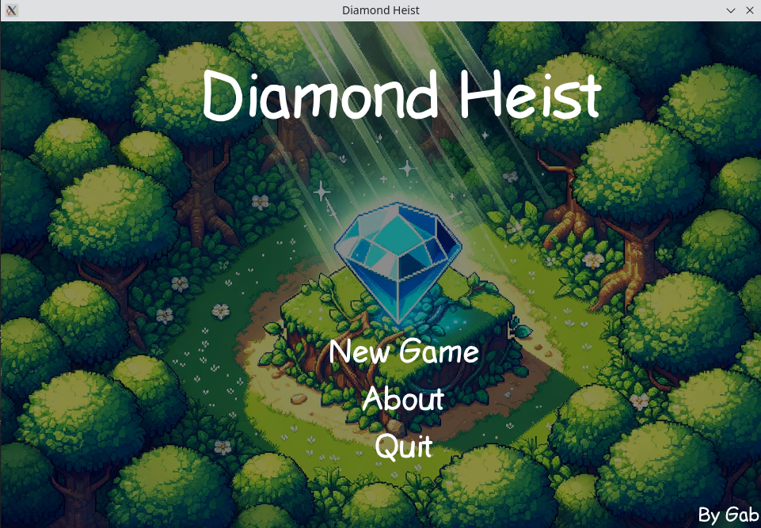
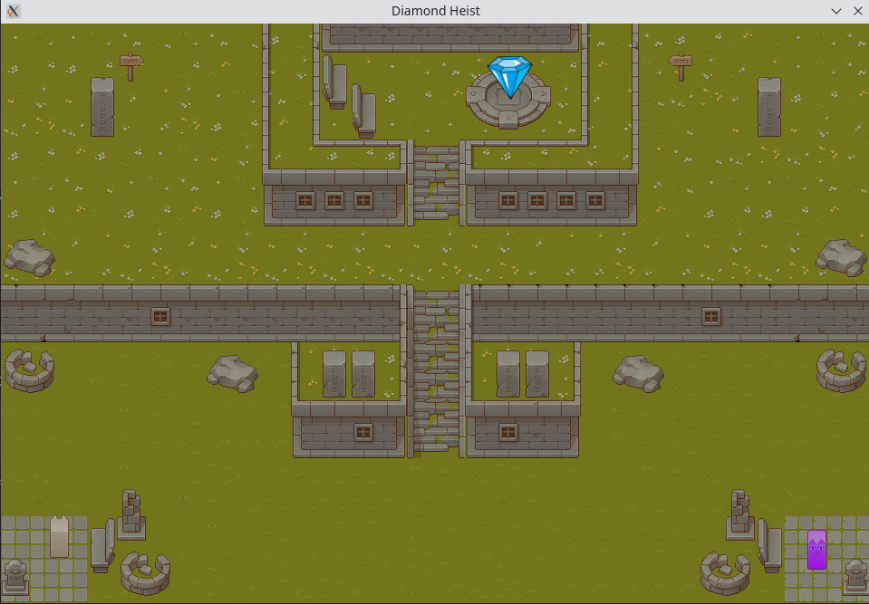
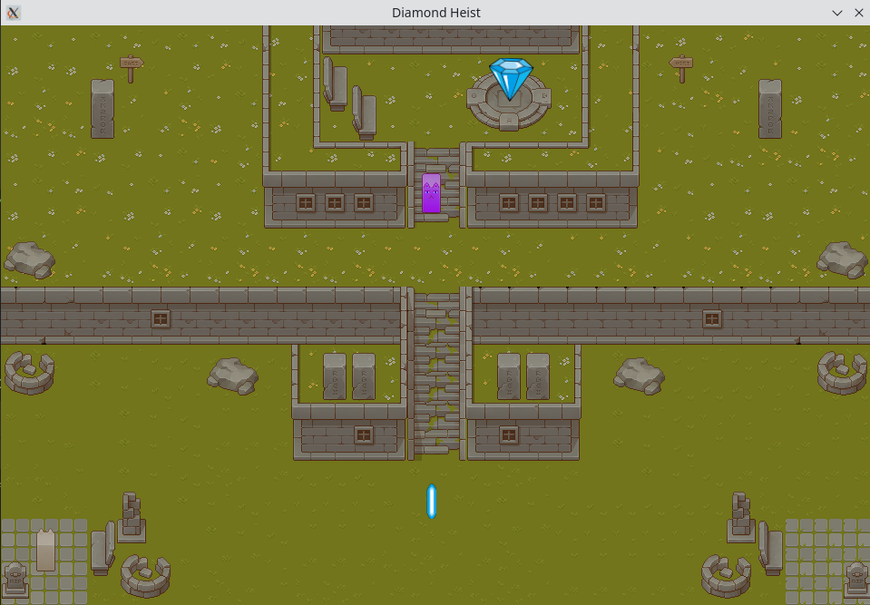
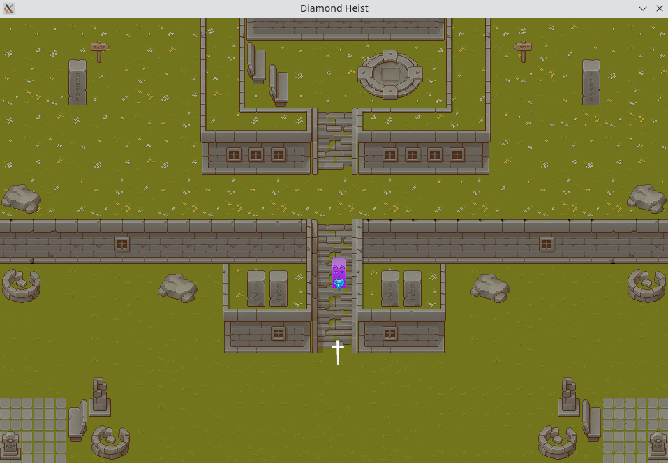
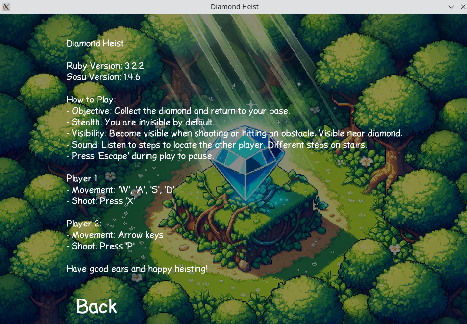
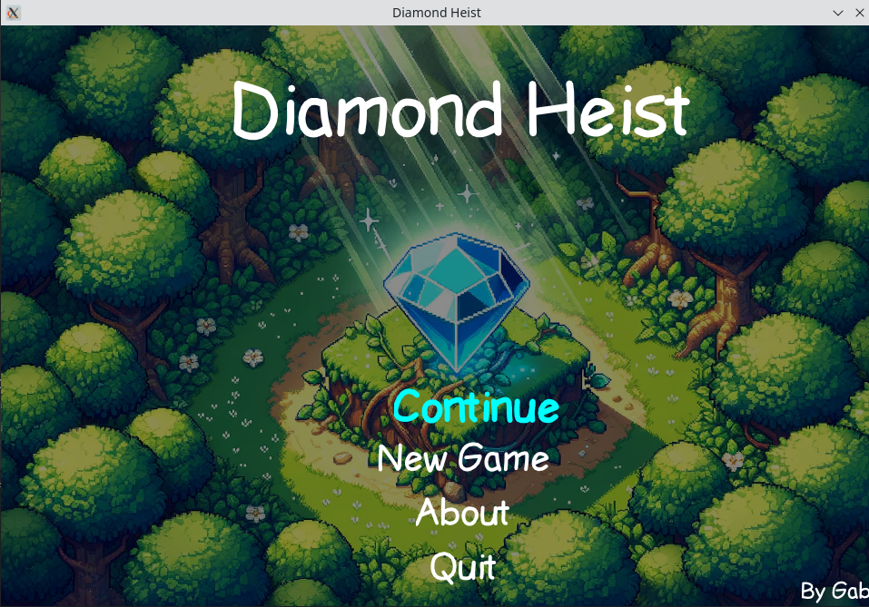

= Diamond Heist

Diamond Heist is a 2D game in which two players try to steal a diamond and bring it to their base. The players are invisible by default (both to themselves and their opponents) but make sounds that can give them away.


== About the environment
The game is written in Ruby using the Gosu library.
Gosu is a multiplatform library that allows you to create 2D games. It uses OpenGL and SDL2 internally.
Read more here: https://www.libgosu.org/.

The game was developed on Linux (Kubuntu), but has also been tested on Windows 10.

== About the game
Diamond Heist is a 2D game in which two players try to steal a diamond and bring it to their base.
Players are invisible by default (both to themselves and to their opponents). They only become visible when an event occurs:

- a player fires a shot
- a player hits an obstacle
- the player is in his base or at the diamond

When any player moves, their footsteps are heard. There are two types of footsteps - on the grass and on the stairs. Also, the game has rich sound effects for other events (shot, impact, player spawning, etc).

The goal of the game is to steal the diamond and bring it to your base. If the player is shot, he is dead for a while and then reappears at his home location. If he is currently carrying the diamond, the diamond is returned to its original location.

More information about the game's controls can be found in the About menu of the game itself.

== Requirements
The game uses several libraries, all listed in the `Gemfile` file. They can be installed using the `bundle install` command.
However, some gems require additional libraries installed on the system.

*Před samotným spuštěním `bundle install` je potřeba nainstalovat `SDL2` a `ImageMagick`.*

=== SDL2
`SDL2` is required for the Gosu library. It can be installed on Ubuntu using the command:
```bash
sudo apt-get install build-essential libsdl2-dev libgl1-mesa-dev libgmp-dev libfontconfig1-dev
```
More info here: https://github.com/gosu/gosu/wiki/Getting-Started-on-Linux.

=== ImageMagick
`ImageMagick` is required to install the `rmagick` gem. On Ubuntu it can be installed using the command:
```bash
sudo apt install build-essential imagemagick libmagickcore-dev libmagickwand-dev
```
More info here: https://github.com/rmagick/rmagick/wiki/Installing-on-Ubuntu

== Launch
Execute from `src` directory:

[source,bash]
----
ruby main.rb
----

== Implementation
This section describes some interesting parts of the implementation. More information can be found in the documentation itself in the link:doc/index.html[doc] directory.

=== Gosu

The typical approach is to inherit from `Gosu::Window` and implement your own `Window`, i.e. mainly the `update`, `draw`, `needs_redraw`, `button_down` methods, or other methods as needed and according to the documentation. These methods are then called repeatedly, this is handled by the Gosu library.

This is exactly the approach I have taken, the very topmost object is the `GameWindow` which contains the `GameState` object and the `update`, `draw` etc methods are called on this object. Subsequent changes to the scene are then just replacing the `state` variable.


=== Hierarchy of classes
I've tried to keep a reasonable structure according to the general rules for writing games: https://gameprogrammingpatterns.com/. This way, for example, I can elegantly have all game objects in one array and simply iterate over them. The most important skeleton of the hiearchy itself is shown in link:doc/diamond_heist_graph.pdf[doc/diamond_heist_graph.pdf]:

image::doc/diamond_heist_graph.svg[]

=== TexturePacker a Tiled
https://www.codeandweb.com/texturepacker[TexturePacker] is a tool that allows you to combine multiple textures into a single png image and create a `json` file that contains information about each texture. I used this tool to create textures for individual game objects.

https://www.mapeditor.org/[Tiled] is a tool that allows you to create maps, and I used this tool to create a game map.

I used the https://github.com/spajus/gosu-texture-packer[gosu-texture-packer] and https://github.com/spajus/gosu-tiled[gosu-tiled] libraries to conveniently load the resulting files.

=== Credits
I downloaded most of the sound effects from https://freesound.org/[freesound.org] and further edited them using https://www.audacityteam.org/[Audacity]. I created most of the graphic elements with inspiration from the https://cainos.itch.io/pixel-art-top-down-basic[top-down-basic] pack and edited them with https://www.gimp.org/[GIMP].

The following book by Mr. Tomas Varaneckas was a very valuable resource for me in the actual implementation:
https://leanpub.com/developing-games-with-ruby/read

== Screenshots









== Video

Youtube video:
image:https://img.youtube.com/vi/ssgaForzwkE/maxresdefault.jpg[link=https://youtu.be/ssgaForzwkE]

link:doc/videos/diamond_heist_record-2023-12-29_18.50.43.mkv[Local link]
